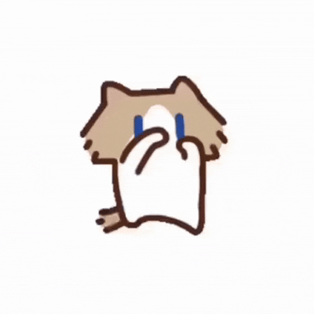

<div align="center">

# Hello, I'm Fyas Azrma ✨


</div>

<br>

<table>
<tr>

<td width="75%">

```txt
✿ better to start learning now, even if you're late
✿ i code better with music on 🎵
✿ trying to survive coding errors 💥
✿ sometimes debugging = staring at screen for hours ☕
✿ [ 猫 • 梦 ] sketches of my code, notes of my dream.
```

</td>

<td width="25%">



</td>

</tr>
</table>

<br>

<div align="center">


</div>

<br>

<div align="center">


</div>

<br>

## 🐱 About Me

- 🎓 Informatics Student
- 💻 Learning Web Development
- ☕ Coffee Addict
- 🐾 Cat Lover
- 🌱 Keep Learning, Keep Growing

<br>

## 🚀 Tech Stack

<p align="center">


</p>

<br>

## 📊 GitHub Stats

<p align="center">


</p>

<br>

## 🔥 Contribution Streak

<p align="center">


</p>

<br>

## 🐍 Contribution Snake

<p align="center">


</p>

<br>

## 🌐 Connect With Me

<p align="center">

<a href="https://github.com/fyasazrma">
GitHub
</a>

</p>

---

<div align="center">

Made with 💛 and lots of ☕

</div>