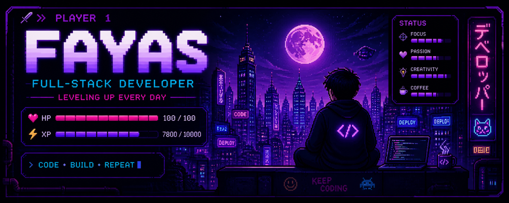

<p align="center">
  
</p>

<h1 align="center">👋 Hey, I'm Fayas</h1>

<h3 align="center">
  💻 Full-Stack Developer · 🎮 Gamer · 🚀 Builder
</h3>

<p align="center">
  
</p>

<p align="center">
  
  
  
</p>

---

## 🧑‍💻 Player Profile

```yaml
Name: Fayasqii Azhar Mauludin
Username: fyasazrma
Role: Full-Stack Developer
Location: Indonesia 🇮🇩
Status: Always Learning 🚀
Focus: Web Development
Hobby: Gaming · Drawing · Music
```

> “Code is not just syntax — it's how you build worlds.”

---

## ⚔️ Skill Inventory

<p align="center">
  
</p>

<details>
<summary>📦 More Tools & Skills</summary>

<br>

<p align="center">
  
  
  
  
</p>

</details>

---

## 📊 Battle Records

<p align="center">
  
  
</p>

<p align="center">
  
</p>

<details>
<summary>🏆 Achievements</summary>

<br>

<p align="center">
  
</p>

</details>

<details>
<summary>📈 Activity Graph</summary>

<br>

<p align="center">
  
</p>

</details>

---

## 🐍 Contribution Snake

<p align="center">
  <picture>
    <source media="(prefers-color-scheme: dark)" srcset="https://raw.githubusercontent.com/platane/snk/output/github-contribution-grid-snake-dark.svg">
    <source media="(prefers-color-scheme: light)" srcset="https://raw.githubusercontent.com/platane/snk/output/github-contribution-grid-snake.svg">
    
  </picture>
</p>

---

<details>
<summary>🎮 Secret Bonus Stage</summary>

<br>

<p align="center">
  
</p>

<p align="center">
  <b>Bonus unlocked:</b> Keep coding, you got this 🚀
</p>

</details>

---

## 📫 Connect With Me

<p align="center">
  <a href="https://github.com/fyasazrma">
    
  </a>
  <a href="mailto:fyasazrma@gmail.com">
    
  </a>
</p>

---

<p align="center">
  
</p>
